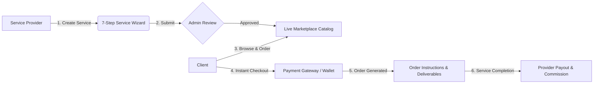

<div align="center">

# 🛠️ Local Service Market

**A Modern, Multi-Vendor Local Service Marketplace Built on Laravel 11**

[](https://laravel.com)
[](https://php.net)
[](https://mysql.com)
[](https://getbootstrap.com)
[](LICENSE)

<p align="center">
  <b>Connect local clients with top verified service professionals. Book quality home, technical, creative, and professional services at transparent, fixed rates.</b>
</p>

[Key Features](#-key-features) •
[Tech Stack](#-tech-stack) •
[Installation Guide](#-installation--setup-guide) •
[Default Credentials](#-default-credentials) •
[Project Structure](#-project-structure) •
[Screenshots & Workflows](#-workflows)

---

</div>

## 🌟 Key Features

### 🛒 Client & Marketplace Frontend
- **Browse & Filter Services**: Search by category, service platform / delivery type, and price range.
- **Direct Fixed-Price Ordering**: Instant checkout with transparent pricing without complicated bidding or auctions.
- **Multiple Payment Methods**: Checkout securely via **Integrated Payment Gateways** or instant **Wallet Balance**.
- **Service Deliverables & Instructions**: Access confidential order instructions, provider contact details, and next steps immediately upon booking.
- **Provider Profiles**: View provider portfolios, verified badges, ratings, and social channels.

### 💼 Service Provider Features
- **7-Step Service Creation Wizard**:
  1. **Category & Platform**: Select category and service channel.
  2. **Service Pricing**: Set transparent fixed prices.
  3. **Portfolio & Description**: Showcase previous work and detailed service scopes with rich text.
  4. **Service Specifications**: Add custom attributes and quality guarantees.
  5. **Deliverables & Instructions**: Set onboarding instructions, contact details, and client requirements.
  6. **Cover & Media**: Upload primary cover images and multi-image work galleries.
  7. **Publish**: Instant preview and submission for review.
- **Provider Dashboard**: Real-time stats on listed services, purchased orders, wallet balance, deposits, and withdrawals.
- **Order Management**: Track customer orders and delivery details.

### 🛡️ Admin Management Panel
- **Manage Services**: Review, approve, reject, or feature service listings (Pending, Approved, Rejected, Sold, Draft).
- **Custom Platforms & Category Management**: Dynamic form builder to define custom fields per service category/platform.
- **User & KYC Management**: Full control over users, identity verifications, and balance management.
- **Financial Controls**: Automatic seller commission/service fee calculation, deposit and withdrawal processing.
- **Support Ticket System**: Integrated customer and provider support ticketing.

---

## 💻 Tech Stack

- **Backend Framework**: [Laravel 11](https://laravel.com)
- **Programming Language**: PHP 8.2+
- **Database**: MySQL 5.7+ / 8.0+ / MariaDB
- **Frontend / Templating**: Blade Templates, Bootstrap 5, jQuery
- **UI Components & Plugins**: Select2, Swiper Slider, Magnific Popup, NicEdit
- **Authentication**: Laravel Session Auth, 2FA Security, KYC Verification

---

## 🚀 Installation & Setup Guide

### Prerequisites
Make sure you have installed:
- **PHP >= 8.2** (with `pdo`, `mbstring`, `openssl`, `curl`, `fileinfo`, `gd` extensions enabled)
- **Composer** ([getcomposer.org](https://getcomposer.org/))
- **MySQL / MariaDB** (via XAMPP, Laragon, or standalone)
- **Web Server**: Apache / Nginx / PHP Built-in Server

---

### Step 1: Clone Repository
```bash
git clone https://github.com/malik2341971-debug/local-service-markit.git
cd local-service-markit
```

---

### Step 2: Install PHP Dependencies
```bash
cd core
composer install
```

---

### Step 3: Configure Environment
Copy the example environment file:
```bash
cp .env.example .env
```

Update your `.env` database configuration:
```env
APP_NAME="Local Service Market"
APP_ENV=local
APP_KEY=
APP_DEBUG=true
APP_URL=http://127.0.0.1:8000

DB_CONNECTION=mysql
DB_HOST=127.0.0.1
DB_PORT=3306
DB_DATABASE=local_service_markit
DB_USERNAME=root
DB_PASSWORD=

PURCHASECODE=LOCAL-DEVELOPMENT-LICENSE
```

Generate the application encryption key:
```bash
php artisan key:generate
```

---

### Step 4: Import Database
1. Create a database named `local_service_markit` in MySQL.
2. Import the database dump located at `install/database.sql`:
```bash
# Using MySQL CLI:
mysql -u root -p local_service_markit < ../install/database.sql
```

---

### Step 5: Start the Application
Run the local development server from the repository root:
```bash
# From project root directory
php -S 127.0.0.1:8000
```
Open your browser and navigate to: **`http://127.0.0.1:8000`**

---

## 🔑 Default Credentials

### 👑 Admin Panel
- **URL**: `http://127.0.0.1:8000/admin`
- **Username**: `admin`
- **Password**: `admin`

### 👤 Demo Service Provider / Client User
- **URL**: `http://127.0.0.1:8000/user/login`
- **Username**: `user`
- **Password**: `user123`

---

## 📁 Project Structure

```text
local-service-markit/
├── assets/                  # Frontend & Admin CSS, JS, Images, Plugins
├── core/                    # Laravel 11 Application Root
│   ├── app/
│   │   ├── Http/Controllers/
│   │   │   ├── Admin/       # Admin Controllers (Services, Platforms, Categories, Users)
│   │   │   ├── User/        # User Controllers (Dashboard, Service Wizard, Orders)
│   │   │   └── WebController.php
│   │   ├── Models/          # Eloquent Models (AccountListing, Category, SocialMedia, User)
│   │   └── Constants/       # System Status Constants
│   ├── bootstrap/           # Application bootstrap & configuration
│   ├── config/              # Laravel configuration files
│   ├── resources/views/
│   │   ├── admin/           # Admin Panel Blade views & navigation JSON
│   │   └── templates/basic/ # Frontend views, components & user dashboard
│   ├── routes/              # Web, Admin, User, API routing definitions
│   ├── storage/             # Application storage & logs
│   └── composer.json        # Dependencies definition
├── Documentation/           # Documentation guides
├── install/
│   └── database.sql         # Full database schema & seed data
├── index.php                # Root entry point
├── .htaccess                # Apache routing rules
└── README.md                # Project documentation
```

---

## 🔄 Workflows



---

## 🤝 Contributing

Contributions, issues, and feature requests are welcome!
1. Fork the Project
2. Create your Feature Branch (`git checkout -b feature/AmazingFeature`)
3. Commit your Changes (`git commit -m 'Add some AmazingFeature'`)
4. Push to the Branch (`git push origin feature/AmazingFeature`)
5. Open a Pull Request

---

## 📄 License

This project is licensed under the [MIT License](LICENSE).

<div align="center">
  <sub>Developed with ❤️ for seamless local service commerce.</sub>
</div>
